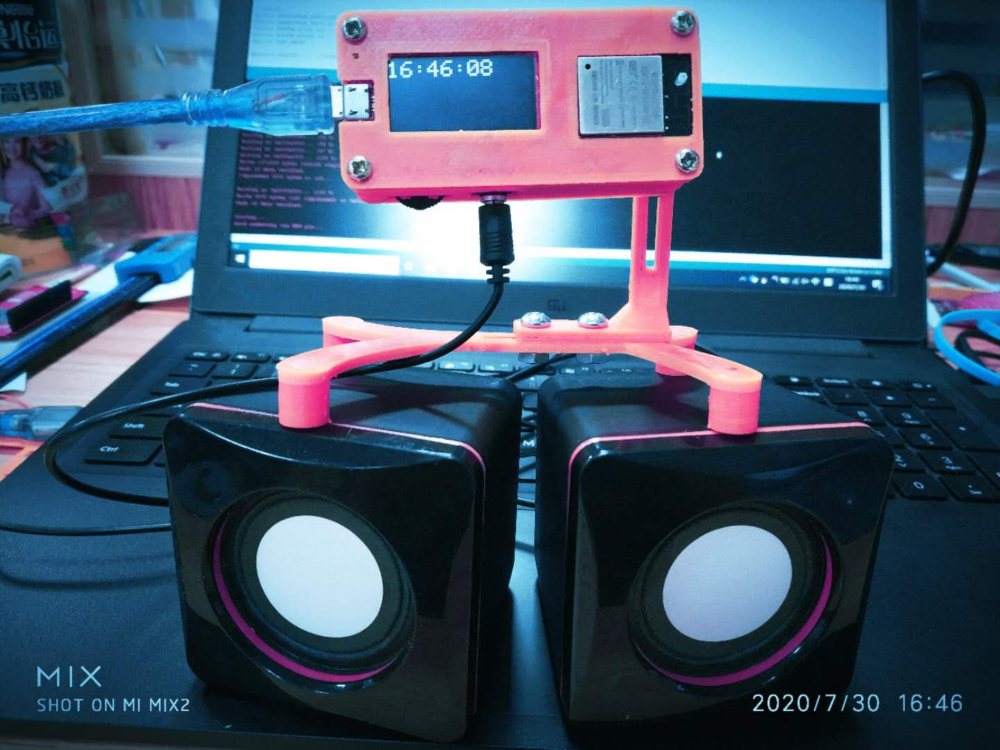
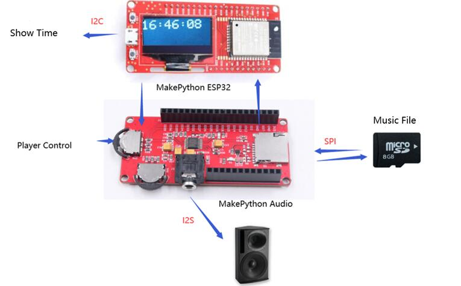
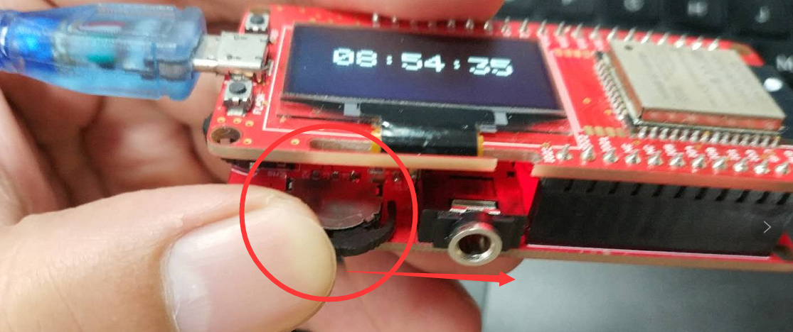
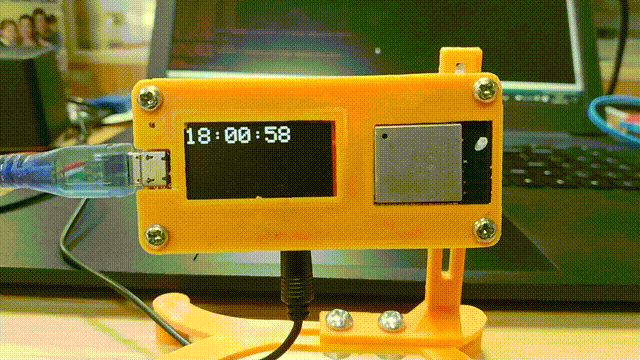
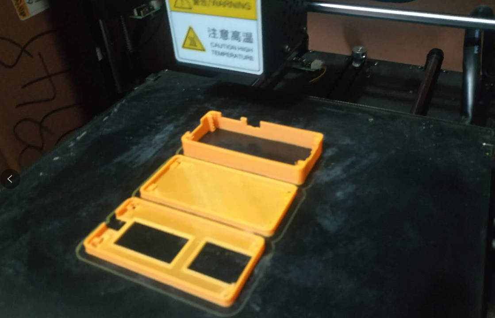
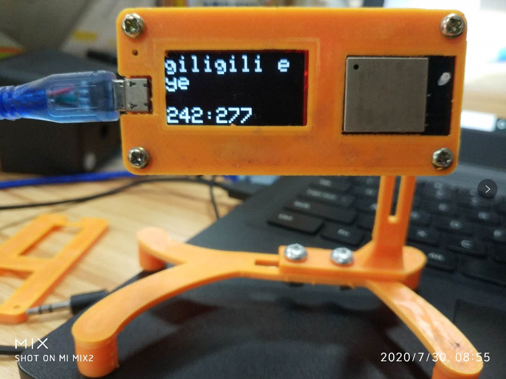

# MicroPython Wakemaster Alarm Clock

```c++
/*
Version:		V1.1
Author:			Vincent
Create Date:	2020/7/30
Note:
2022/3/19	Add a bluetooth speaker demo.
*/
```




[toc]

# OVERVIEW

## Intruduce

[Makerfabs home page](https://www.makerfabs.com/)

[Makerfabs Wiki](https://makerfabs.com/wiki/index.php?title=Main_Page)

MakePython ESP32 and Audio, which play music from an SD card.ESP32 connects to WiFi to get the exact NTP time.When the alarm clock is set, the music automatically plays and can be plugged into the subwoofer at home.When the alarm clock reminds you, you will never fall asleep again!




## Equipment list

- [MakePython ESP32](https://www.makerfabs.com/wiki/index.php?title=MakePython_ESP32)
- [MakaPython Audio](https://www.makerfabs.com/wiki/index.php?title=MakaPython_Audio)
- Audio/headphones with 3.5mm audio connector
- Micro SD card

# STEPS

## Prepare And Burn

**If you have any questions，such as how to install the development board, how to download the code, how to install the library. Please refer to :[Makerfabs_FAQ](https://github.com/Makerfabs/Makerfabs_FAQ)**

- Install board : esp32 .
- Install library : Adafruit SSD1306 and dependent libraries.
- Install zip library : [ESP32-audioI2S](https://github.com/schreibfaul1/ESP32-audioI2S)("Audio.h")
- Open file "/Project_Wakemaster-Alarm-Clock/Wakemaster/Wakemaster.ino"
- Change the time WiFi ssid and password.

```c++
//WIFI
const char *ssid = "Makerfabs";
const char *password = "20160704";
```

- Change the time when you want clock alarming.

```c++
//NTP time
//const char* ntpServer = "pool.ntp.org";
const char *ntpServer = "120.25.108.11";
const long gmtOffset_sec = 8 * 60 * 60; //中国+8
const int daylightOffset_sec = 0;
String clock_time = "15:50:00";
String clock_time2 = "15:53:00";
```

- Upload to esp32.


- **~~ATTENTION !!! Plug ESP32 and Audio expansion boards together after burning. Be sure to plug them together after burning or the firmware will not burn.~~** 
- **MicroPython Audio can be downloaded without unplugging. When uploading the program, please rotate the switch next to the 3.5mm Audio interface to the Audio socket.**



## Prepare Clock Music

- Add a wav music into SD card, name is "clock.wav".(Support mp3 too, but you need change the code.)
- Insert a Micro SD card into MakePython Audio.
- Plug the stereo or earphone into a 3.5mm audio jack.

## How to use Alarm Clock

- Set alarm time in code.
- Set Wifi password.
- When the alarm goes off, you can press the left button inward. Turn off the sound and show the time.



# 3D Printer Box

We designed a simple 3D-printed case. Don't need support.

[STL File](https://github.com/Makerfabs/Project_MakePython_Audio_Music/)






# BT Speaker

Have some noise, I don't know why....
Use library: https://github.com/tierneytim/btAudio

